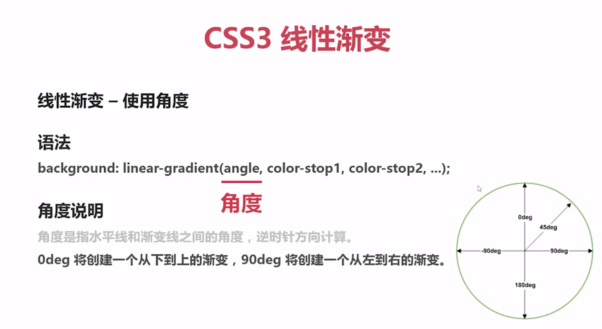

# 概述

## CSS3背景图像定位

* `background-clip`属性

`background-clip`属性指定背景的绘制区域

语法：`background-clip:border-box|padding-box|content-box`

* `background-origin`属性

`background-origin`属性指定`background-position`属性应该是相对位置

`background-origin`设置元素背景图片的原始起始位置

语法：`background-position:padding-box|border-box|content-box`

* `background-size`属性

语法：`background-size:length|percentage|cover|contain`;

* CSS3允许您为元素使用多个背景图像

语法：`background-image:url(img1.png),url(img2.png)`;

元素引用多个背景图片，前面图片依次覆盖后面图

* 背景缩写属性可以在一个声明中设置所有的背景属性

语法：`background:color position size repeat origin clip attachment image`;

## CSS3渐变

* 渐变

可以在两个或多个指定的颜色之间显示平稳的过渡

* 线性渐变

是沿着一根轴线改变颜色，从起点到终点颜色进行循序渐变（从一边拉向另一边）

语法：`background:linear-gradient(direction,color-stop1,color-stop2,...)`

线性渐变默认从上-下

* 径向渐变

从起点到终点颜色从内向外进行圆形渐变（从中间向外拉）

语法：`radial-gradient(center,shape size,start-color,....,last-color)`

颜色结点均匀分布（默认）

