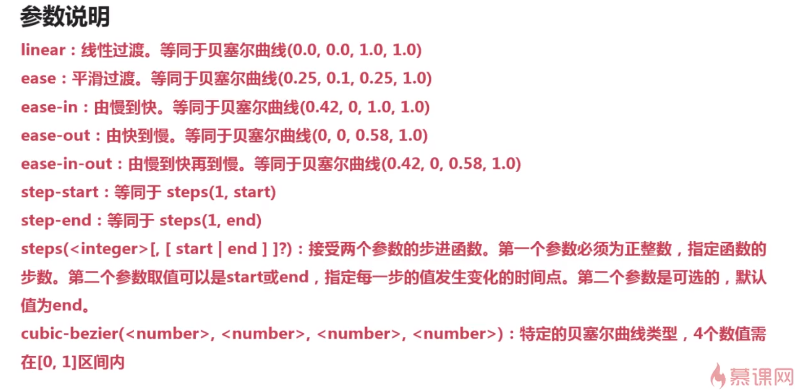
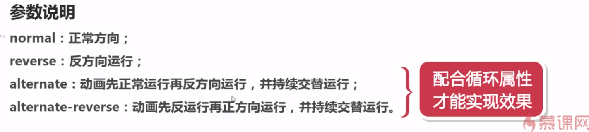
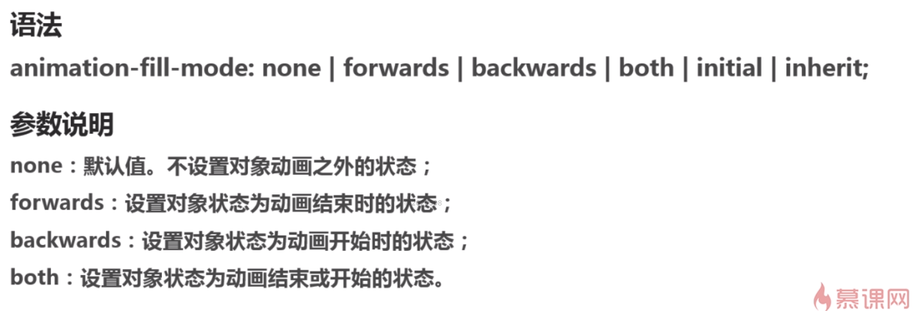
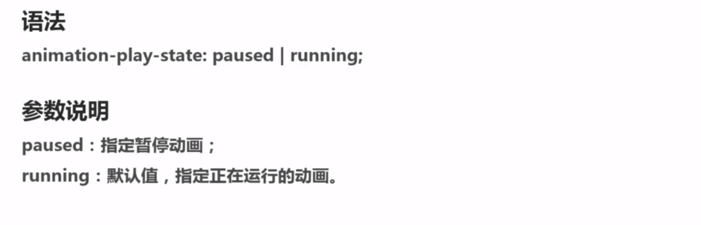
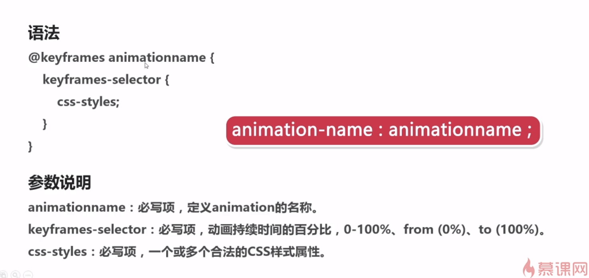

# `animation`属性

## `animation-name`

- 检索或设置动画所应用的动画名称

语法：`animation-name:keyframename|none;`

参数说明：

- `keyframename`：指定要绑到选择器的关键帧的名称
- `none`：指定有没有动画（可用于覆盖从级联动画）

## `animation-duration`属性

- 检索或设置对象动画的持续时间

语法：`animation-duration:time;`

参数说明：

- time指定动画播放完成花费的时间。默认值为0，意味着没有动画效果

## `animation-timing-function`

- 检索或设置对象动画的过渡类型

语法：`animation-timing-function:ease|linear|ease-in|ease-out|ease-in-out|step-start|steps(<integer>[,[start|end]]?)|cubic-bezier(<number>,<number>,<number>,<number>);`

## `animation-delay`

- 检索或设置对象动画的延迟时间

语法：`animation-delay:time;`

参数说明：

可选。定义动画开始前等待时间，以秒或毫秒计。默认值为0

定义一个负值会让动画立即开始。但是动画会从它的动画序列中某位置开始。例如，如果设定值为-1s，动画会从它的动画序列的第1秒位置处立即开始。

## `animation-iteration-cont`

- 检索或设置对象动画的循环次数

语法：`animation-iteration-count:infinite|<number>;`

参数说明：

`<number>`为数字，其默认值为“1”;`infinite`为无限次数循环

## `animation-direction`属性

- 检索或设置对象动画在循环中是否反向运动

语法：`animation-direction:normal|reverse|alternate|alternate-reverse|initial|inherit`

## `animation-fill-mode`

- 规定当动画不播放时候（当动画完成或当动画有延迟未播放时候），要应用到元素的样式

## `animation-play-state`

- 指定动画是否正在播放或已暂停

## `keyframes`

- 关键帧，可以指定任何顺序排列来决定animation动画变化的关键位置

使用说明

使用`@keyframe`规则创建动画，通过逐步改变从一个CSS样式设定到另一个。

在动画过程中可以通过`@keyframes`规则多次更改css样式的设定。

