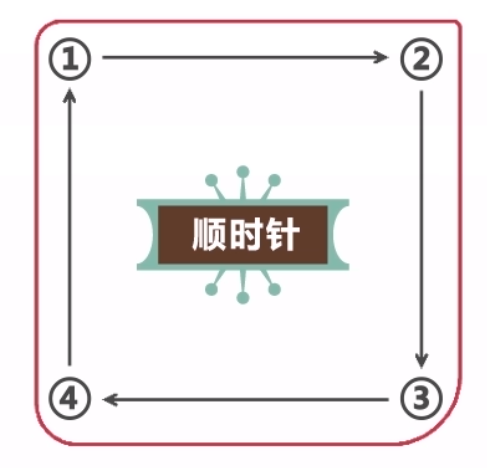
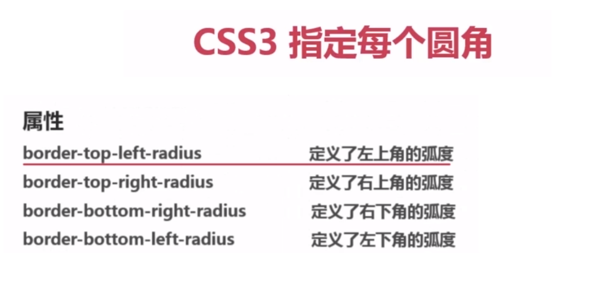

# 圆角

## `border-radius`

一个最多可指定四个`border-*-radius`属性的复合属性，这个属性允许你为元素添加新圆角边框

语法:

border-radius:1-4 length|%  /  1-4 length|%

多值：

四个值：第一个值为左上角，第二个值为右上角，第三个值为右下角，第四个值为左下角

三个角：第一个值为左上角，第二个值为右上角和左下角，第四个值为右下角

两个值：第一个值为左上角与右下角，第二个值为右上角与左下角

一个值：四个圆角值都相等

