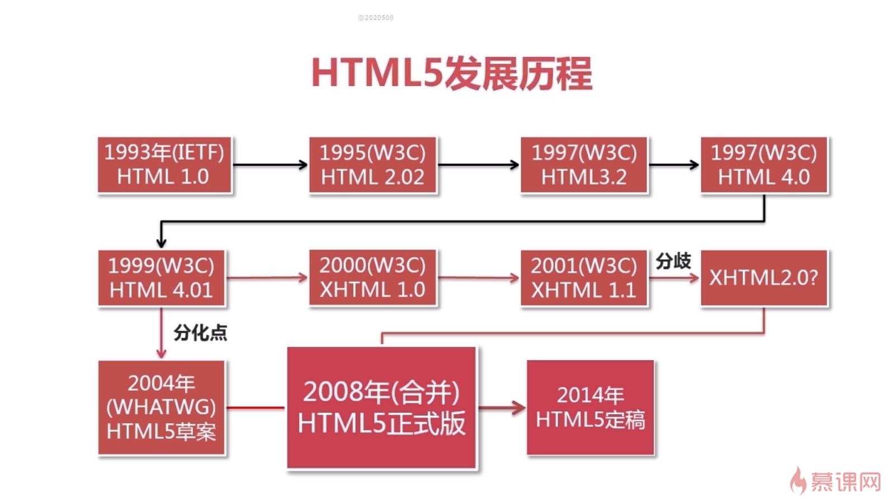

# html5简介

## html5是什么
html5 约等于 HTML + CSS + JavaScript + API

## HTML发展历史

## HTML5定稿带来了什么？
*   web增强与垄断,
    *   webpapp
        *   HTML5新增了离线存储，更丰富的表单、JS线程、scoket、标准扩展embed、
    css3……
    *   流媒体与多媒体引擎 - audio、video、canvas、webgl等等
    *   搜索引擎和无障碍领域

*   移动互联网
    *   跨平台
        *   HTML5是唯一一个通吃PC、MAC、IPHONE、ANDROID等主流平台的跨平台语言

*   快速迭代
    *   互联网产品多数免费、且具有网络效应，后入者抢夺用户的难度非常大

*   减低成本
    *   HTML5开发比原生开发成本低一倍

*   导流入口多
    *   HTML5应用导流非常容易

*   分发效率高

*   web改变趋势
    *   Native app -> web app -> hybrid app
        *   navtive app开发成本高
        *   web app有性能问题
        *   hybrid app综合两者优势诞生
    *   pc -> 移动 -> 智慧互联
    *   ar、vr、智能硬件
    *   视频变局、在线教育、泛娱乐